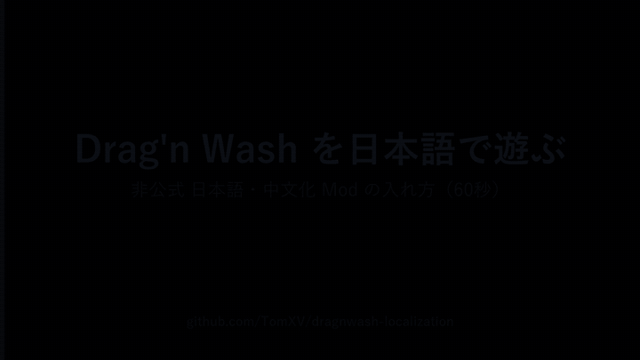

# Drag'n Wash Localization

[English](README.md)

[Drag'n Wash](https://store.steampowered.com/app/4739660/) 用の BepInEx ベースの非公式・多言語ローカライズ Mod です。
多くの言語でゲームを遊べます（[言語パック](#言語パック)参照）。どの言語も、コードを書かずに CSV を編集するだけで
追加・改善できます。

技術的な調査結果と実装計画は [docs/PLAN.md](docs/PLAN.ja.md) を参照してください。

> [!WARNING]
> ## ⚠️ ネタバレ注意 ⚠️
> **`Translations/` の CSV には、ゲームの全会話がストーリーの進行順で入っています。**
> 中身を見るのはネタバレ注意です！ まずはゲームを何度か周回してから開くことをおすすめします！

## 導入方法

### かんたん導入（推奨）

導入方法はすっごく簡単です。

1. [Releases](https://github.com/TomXV/dragnwash-localization/releases) から zip をダウンロードして展開する
2. **`Install.exe` をダブルクリック**
3. 言語を選んで、**「インストール / 更新」をポチッ**

## ね？ 簡単でしょ？ ( ･´ｰ･｀)ドヤッ

ゲームフォルダは Steam から勝手に見つけます（見つからなければ選ぶだけ）。BepInEx が入っていなければ、公式の 5.4.23.5 を自動でダウンロードして入れます（SHA-256 で検証済み）。あとは Steam からゲームを起動するだけです。

言語は 日本語 / 简体中文 / English（翻訳しない）に加えて、仮翻訳の繁体字中国語・ドイツ語・フランス語・スペイン語・ブラジルポルトガル語・韓国語・ロシア語・ポーランド語・ヘブライ語、面白枠のエスペラント・トキポナから選べます（[言語パック](#言語パック)参照）。同じ画面に「アンインストール」ボタンもあり、セーブ履歴は既定で残します。インストーラーが入れた BepInEx は、他の Mod がなければ一緒に消せます。

手動で導入したい場合は、以下の手順に従ってください。

### 動画で見る




> [!NOTE]
> **`Install.exe` を押しても何も起きない、または「Windows によって PC が保護されました」と出る場合**
> `Install.exe` は署名のない小さなプログラムなので、初回だけ Windows SmartScreen が止めることがあります。
> - 警告画面が出たら **「詳細情報」→「実行」** を押してください
> - 何も出ないときは、同じフォルダの **`Install.cmd`** をダブルクリックしてください。黒い窓が一瞬出るだけで、同じインストーラー画面が開きます
> - それでも駄目なら、`Install.exe` を右クリック → プロパティ → 一番下の **「許可する」** にチェック → OK のあと、もう一度ダブルクリック

### Steam Deck / Linux（動作確認済み）

> [!IMPORTANT]
> Steam Deck での動作は **v0.3.0 以降**です。それより前のバージョンでも起動はしますが、Deck では F1 メニューを操作できません。

Linux ネイティブ版のゲームと Linux 版 BepInEx で動きます。`Install.exe` は使えないので手動で入れます（デスクトップモードで作業）。

1. [BepInEx_linux_x64_5.4.23.5.zip](https://github.com/BepInEx/BepInEx/releases/download/v5.4.23.5/BepInEx_linux_x64_5.4.23.5.zip) をゲームフォルダ（`~/.local/share/Steam/steamapps/common/Drag'n Wash/`）に展開する
2. この Mod の zip の `BepInEx/` を同じ場所に重ねる
3. `run_bepinex.sh` を開き、`executable_name="DragNWash"` にして保存。`chmod +x run_bepinex.sh` で実行権限を付ける
4. Steam のゲームのプロパティ → 起動オプションに `./run_bepinex.sh %command%`
5. 起動する。言語は `BepInEx/config/com.tomxv.dragnwash.localization.cfg` の `TargetLocale`（初回起動後に生成）で変えられます

フォントの準備は不要です。ゲーム本編の文字は SteamOS 標準の Noto Sans CJK をファイルから直接読み（日本語・中国語・韓国語の各書体）、F1 メニューは同梱の Noto Sans JP（`dragnwash-menufont.bundle`）で描きます（Steam の Linux ランタイム内では Unity のメニュー描画から CJK フォントが見えないため）。このメニュー用フォントにはハングルとヘブライ文字がないので、Deck の F1 の言語ボタンではこの 2 言語はロケールコードで表示されます。ゲーム本編は通常どおり表示されます。

Deck（ゲーミングモード）での F1 メニューの操作:

- **F1** を Steam Input でボタンに割り当てて開く
- 右トラックパッドかタッチ画面でポインタを合わせ、**A**・**R2**・トラックパッド押し込みのどれかで押す（Steam Input はトラックパッド押し込みをマウスクリックではなくスティック押し込みとして送るので、Mod 側で対応しています）
- タイトルバーでボタンを押したまま動かすと移動、右下の角なら大きさ変更
- スティックと十字キーで、ポインタが乗っている一覧をスクロール

> [!NOTE]
> **macOS** は未検証です。BepInEx の macOS 版と同じ手順で動く可能性があり、フォントは Hiragino / PingFang を探します。試した結果を Issue で教えてもらえると助かります。

### 手動で導入する

### 必要なもの

- Steam版（Windows）の Drag'n Wash
- [BepInEx 5 Windows x64（Mono）版](https://github.com/BepInEx/BepInEx/releases)
- このリポジトリの [Releasesページ](https://github.com/TomXV/dragnwash-localization/releases) で配布される最新版の `DragNWashLocalization-<version>.zip`

> [!IMPORTANT]
> ReleasesのAssetsにある `DragNWashLocalization-<version>.zip` を使用してください。GitHubが自動生成する **Source code** のZIPはMod導入用ではありません。ReleasesページにModのZIPがまだない場合は、導入可能なビルドが未公開です。

### 1. ゲームフォルダを開く

Steamライブラリで **Drag'n Washを右クリック → 管理 → ローカルファイルを閲覧** を選びます。ゲームの `.exe` が置かれているフォルダがゲームルートです。

### 2. BepInExを導入する

BepInEx 5の **Windows x64（Mono）版**をダウンロードし、アーカイブの中身をゲームルートへ直接展開します。

展開後、ゲームの実行ファイルと同じ場所に `winhttp.dll`、`doorstop_config.ini`、`BepInEx` フォルダが並んでいることを確認してください。これらがもう1段内側のフォルダに入っている場合は、ゲームルートへ移します。

ゲームを一度起動し、タイトル画面まで進んだら終了します。BepInExの設定ファイルとログが生成されるので、次へ進む前に `BepInEx/LogOutput.log` が存在することを確認します。

### 3. Drag'n Wash Localizationを導入する

[Releases](https://github.com/TomXV/dragnwash-localization/releases) から `DragNWashLocalization-<version>.zip` をダウンロードし、BepInExと同じ**ゲームルート**へ展開します。`BepInEx` フォルダの統合を確認された場合は許可してください。

プラグインのDLLが次の場所にあれば正しく展開されています。

```text
<Drag'n Washのフォルダ>/BepInEx/plugins/DragNWashLocalization/DragNWashLocalization.dll
```

ZIPファイルや `DragNWashLocalization-<version>` フォルダが `plugins` とDLLの間に入らないようにしてください。

### 4. 起動して確認する

Drag'n Washを起動します。手動導入では日本語で始まります（インストーラーを使った場合は選んだ言語）。**F1**でローカライズメニューを開き、**Tools**から導入済みの言語へ再起動なしで切り替えられます。

`BepInEx/LogOutput.log` に `DragNWashLocalization` の起動行が記録されていれば、プラグインは読み込まれています。

起動時の言語を手動で変更する場合は、ゲームを終了して次のファイルを開きます。

```text
BepInEx/config/com.tomxv.dragnwash.localization.cfg
```

`[General]` の `TargetLocale` を `ja` や `zh-Hans` などの導入済みロケールへ変更し、ゲームを起動し直します。`en` にすると Mod を入れたまま英語の原文で遊べます（インストーラーとゲーム内 F1 メニューでも同じ選択ができます）。

### Modが読み込まれない場合

- BepInExとModの両方を、ゲームの実行ファイルがあるフォルダへ展開したか確認します。
- DLLが上記のパスにあるか確認します。
- `BepInEx/LogOutput.log` を開きます。ファイル自体がない場合はBepInExが起動していません。ファイルがある場合は `DragNWashLocalization` を検索し、周辺のエラーを確認します。
- Optionsを開いたときにDirect3D 12でクラッシュする場合は、[設定画面を開くとクラッシュする場合（Windows）](#設定画面を開くとクラッシュする場合windows) の回避策を試してください。

## 言語パック

翻訳ファイルはすべて TomXV が作成し、同じ zip に同梱しています。インストーラーと F1 メニューは `Translations/` 配下のフォルダを自動で一覧にします。

| ロケール | 言語 | 状態 |
| --- | --- | --- |
| `ja` | 日本語 | 作者が監修 |
| `zh-Hans` | 简体中文 | 作者が監修 |
| `zh-Hant` | 繁體中文 | 仮翻訳（監修済みの簡体字版を台湾の言い回しで繁体字化） |
| `de` | Deutsch | 仮翻訳 |
| `fr` | Français | 仮翻訳 |
| `es` | Español | 仮翻訳 |
| `pt-BR` | Português (Brasil) | 仮翻訳 |
| `ko` | 한국어 | 仮翻訳 |
| `ru` | Русский | 仮翻訳 |
| `pl` | Polski | 仮翻訳 |
| `he` | עברית | 仮翻訳（右から左に表示） |
| `eo` | Esperanto | 仮翻訳（面白枠） |
| `tok` | toki pona | 仮翻訳（面白枠。単語が 137 個しかない言語なので、かなりざっくり） |
| `en` | English | ゲーム本来の英語（翻訳なし） |

> [!NOTE]
> **仮翻訳**はネイティブスピーカーの監修を受けていません。全行そろっていて通しで遊べますが、不自然な言い回しやジョークの取りこぼしがあり得ます。作者が監修したのは日本語と簡体字中国語のみです。ネイティブの方からの修正 PR を歓迎します（[CONTRIBUTING.ja.md](CONTRIBUTING.ja.md)）。各 `strings.csv` の先頭にも同じ注記をコメントで入れています。

## 翻訳者向け

`Translations/<locale>/strings.csv` を編集するだけで翻訳を追加できます。公開ファイルは
`key,section,node,order,speaker,translation` の列を持ちます。`key` は英語原文のハッシュ、`section` / `node` / `order` はゲーム内のどこ（レベルと会話）で流れるかをプレイ順で示し、`speaker` は誰の台詞かです。`#` で始まる行は `# ===== Level 1: Ryan (Sunny) =====` のような見出しで、ファイルを上から読むと台本のように流れが追えます。
おすすめの作業手順：

1. ゲーム内で **F1 → Tools → Export working copy** を押す。`Translations/_discovered/<locale>.working.csv`
   に、各行の英語原文を並べた作業用ファイル（`key,section,node,order,speaker,source_en,translation`）が、同じ見出しつきでゲーム内の実行順に書き出されます
2. `translation` 列を編集して保存する。起動中のゲームにその場で反映されます
3. コミット前に **F1 → Tools → Hash for commit**（または `tools/hash-strings.ps1`）で、英語原文を含まない `strings.csv` を作り直す

リポジトリにはゲームの英語台本を含めない方針で、**製品版を持っている人だけが翻訳できる**仕組みです。
各言語フォルダには表示名を書いた1行の `name.txt`（例: `日本語`）があり、インストーラーとゲーム内メニューに表示されます。
Unity内部のキー名などを知る必要はありません。手順は [CONTRIBUTING.ja.md](CONTRIBUTING.ja.md) を参照。書式タグ（`<size=70%>`など）が原文に
含まれている場合は、タグ構造をそのまま残して中の文章だけ訳してください。

### 会話文をまとめて確認したい場合

プラグイン導入後、ゲーム内（セーブをロードした後）で **F6キー** を押すと、全会話文が
`BepInEx/plugins/DragNWashLocalization/Translations/_discovered/dialogue_lines.csv`
に一括で書き出されます（実機で1839行を確認済み）。

行は**ゲーム内で実際に流れる順**に並びます。`node` 列が会話の単位で、
`Alexander_2_intro` のように「キャラクター名＿何回目＿場面」の形になっており、
`order` 列がその会話内での順番です。`kind` 列は `line`（キャラクターの台詞）と
`option`（プレイヤーが選ぶ選択肢）を区別します。誰が誰に何と答えているかが分かるので、
前後を見ながら訳せます。登場するドラゴンは Conrad / Ryan / Alexander の3体です。

訳したい行を `Translations/<locale>/strings.csv` にコピーし、`translation` 列を埋めて
PRを送ってください（`node` や `key` など余分な列が付いたままでも問題なく読み込まれます）。
すでに訳した行は `translation` 列に訳が入った状態で出力されるので、再ダンプしても
作業は失われません。

### 編集した訳を再起動なしで確認する

ゲームを起動したまま `Translations/<現在の言語>/strings.csv` または作業用ファイル
`_discovered/<locale>.working.csv` を保存すると、約2秒後に自動で読み直され、画面に出ている
テキストにもその場で反映されます。変わった行は F1 の Activity log に1行ずつ出ます。
訳を直しては画面で確かめる、を再起動なしで繰り返せます（`[Debug] HotReloadTranslations`
で無効化可能）。反映されたかは F1 の Activity log に `[reload]` で出ます。

### UI文言をまとめて確認したい場合

**F7キー** で、読み込み済みの全UIテキストが
`Translations/_discovered/ui_texts.csv` に書き出されます。**非表示のメニューも対象**なので、
ポーズメニューや確認ダイアログを開かなくても、そのシーンのUI文言が丸ごと手に入ります。
列は `key` / `source_en` / `translation`（訳済みなら既存の訳）/ `object_path`（画面上のどこか）です。

タイトル画面とゲーム中で1回ずつ押せば、ほぼ全てのUIが揃います。

未翻訳のUI文言は、プレイ中に自動的に
`Translations/_discovered/strings.csv` にも記録されます。このファイルは起動のたびに
整理され、すでに訳した行や重複は取り除かれるので、常に「残りの作業リスト」になります。

### 訳す必要のない文字列について

スライダーの数値・解像度（`1920 x 1080 @ 164.995Hz`）・ビルド番号などは、
最初から記録の対象外です。除外パターンは [Translations/ignore.txt](Translations/ignore.txt)
に追記できます（正規表現、ファイル内に記述例あり）。

除外されるのは「記録」だけです。翻訳の検索のほうが先に行われるため、
`strings.csv` に書いた行は除外パターンに一致していても必ず翻訳されます。

### ゲーム内デバッグメニュー

**F1キー** でデバッグウィンドウを開閉できます（設定で変更可能）。
タイトル部分をドラッグして移動、右下の角をドラッグしてサイズを変更できます。

- **Activity log**: 翻訳結果と処理ログを表示します。`Follow: ON/OFF` で末尾への
  自動追従を切り替えられ、手動スクロールすると追従が止まります。`Clear log` は
  表示と重複抑制をリセットします。ログは直近100件を保持します。
- **Tools**: 再起動なしで言語を切り替えます（ボタン名は各言語の `name.txt`、**English** は翻訳オフ）。
  会話の書き出し（`Export loaded dialogue`）、UI文言の書き出し（`Export UI text`）、
  原文つき作業ファイルの書き出し（`Export working copy`）、公開ファイルの作り直し（`Hash for commit`）、
  レイアウトチェックもここから行います。
- **Saves**: セーブの巻き戻し、レベル番号の変更、フラグの反転。後述。
- **About**: 動いている版とビルド、制作者、ライセンス、今回の起動で読み込んだ内容。不具合報告のときにそのまま引用できます。

**Check translation layout** ボタンで、レイアウト崩れリスクのある文字列を
`Translations/_discovered/layout_risks.csv` に書き出せます（しきい値は
`BepInEx/config/.../LayoutOverflowThreshold`、既定 `1.0` ＝ ちょうど収まる）。

### セーブを1つ前に戻す（翻訳確認用）

ゲームがセーブを書き込むたびに、プラグインが
`BepInEx/plugins/DragNWashLocalization/SaveHistory/<スロット>/` に世代コピーを残します
（スロットごとに既定30世代、`[Debug] SaveHistoryKeep` で変更可）。
**F1 → Saves** タブでスロットを選び、戻したい世代の **Restore** を押すと、その世代が
ゲームのセーブファイルに書き戻されます。**その後タイトル画面に戻ってスロットをロード**すると
反映されます（ゲーム内でセーブすると再び上書きされます）。復元前の状態も自動で
世代に残るので、戻しすぎても元に戻せます。

同じ場面の会話を訳し直して見比べたいときに使ってください。Restore はフラグや変数を
直接いじるわけではなく、ゲーム自身のセーブファイルを差し替えるだけです。

同じタブの **PROGRESS** 欄では、レベル番号を **-** / **+** で変えて **Apply** できます。
先に進める方向はネタバレの可能性があるので確認が出ます。**Flags...** を押すと、ゲームが使う
イベントフラグが分類（レベル進行 / ストーリー / 恋愛 / シーン発生条件 / シーン視聴済み / アイテム）と
説明つきで全部並びます。セーブにまだ存在しないフラグも「unset」として表示され、値をクリックすると
unset → true → false の順に切り替わります。検索欄で絞り込み、**Reset all to false...** で全フラグを
一括で false にできます（レベル番号は保持）。一覧は DLL の隣の `FlagCatalog.csv` から読むので、
後から見つけたフラグを行として追加できます。どの編集も直前の
状態をスナップショットに残してから行われます。

## 設定画面を開くとクラッシュする場合（Windows）

Unity 6000.3.14f1 / DirectX 12 環境で、Options を開いた際に
`D3D12ScratchAllocator::DestroyScratch` で落ちる問題がありました。同じスタックの
[Unity公式の不具合報告（UUM-140564）](https://issuetracker.unity.com/issues/10698)
があり、ネイティブ描画側のバグなので翻訳フックで例外を捕捉しても防げません。

このバグは**実行中のテクスチャ確保・アップロード**で踏みます。そのため Direct3D 12 では、
導入済みの全言語のフォントを起動時に準備し、ゲーム中も F1 メニューでの言語切り替え時も
フォントアトラスに何も追加しないようにしています。各文字はその言語が使うフォント 1 つにだけ
焼き込むので、起動時の処理は小さく済みます。言語を何度も切り替えても落ちないことを
実機で確認済みです。設定は不要です。

Direct3D 11 や Steam Deck の Vulkan など他の描画 API は実行中のアップロードに耐えるので、
使用中の言語だけを準備し、ほかの言語は選んだ時に読み込みます。そちらでも起動時に全部準備したい
場合は `[Font] PreloadAllLocales = true` にしてください。

それでも落ちる場合は、Steamライブラリで
**Drag'n Wash → プロパティ → 一般 → 起動オプション** に `-force-d3d11` を追加して
再起動すると、描画APIごとバグを回避できます
（[Unity標準の起動オプション](https://docs.unity3d.com/6000.3/Documentation/Manual/PlayerCommandLineArguments.html)。
ゲーム本体のDLL・セーブデータは変更されません）。
`BepInEx/LogOutput.log` のプラグイン起動行で、実際に使われている描画APIを
`graphics=...` として確認できます。

`BepInEx/config/com.tomxv.dragnwash.localization.cfg` の `[Font] AtlasPointSize`
を下げると、フォントアトラスの枚数が減り、上げると文字が鮮明になります（既定80）。

## 現在のステータス

v0.4.0 をリリース済み（13 言語、言語ごとのフォント準備、About タブ、英日対応のインストーラー）。その前の v0.3.0 で Steam Deck に対応しました。BepInExプラグインの骨格、UI文字列・会話文の日本語/中国語差し替え、
CJKフォント表示、会話・UIの一括抽出、ゲーム内デバッグメニュー、レイアウト崩れ検出、
翻訳者向けドキュメント、リリース手順を実装・実機確認済みです。
詳細は [docs/PLAN.md](docs/PLAN.ja.md) を参照してください。

## 翻訳に参加する

コード不要で `Translations/<locale>/strings.csv` を編集するだけで参加できます。
手順・書式・未翻訳の見つけ方は [CONTRIBUTING.ja.md](CONTRIBUTING.ja.md) を参照してください。

## 配布・リリース

リリース zip のビルドと配布手順は [docs/RELEASING.md](docs/RELEASING.ja.md) を
参照してください（ゲーム由来の参照アセンブリをコミットできないため、リリースは
ローカルでビルドして GitHub Releases にアップロードします）。

## 開発者の方へ

本プロジェクトは非公式のファン制作物で、Gator Dragon Games とは無関係です。ゲームのアセットや台本は含まず、英語原文は SHA-256 ハッシュとしてのみ保持し、ゲームのファイルを書き換えることもありません（BepInEx が実行時にプラグインを読み込みます）。開発チームの方で懸念がある場合は、このリポジトリの Issue かメンテナーへの連絡でお知らせください。ご希望に応じて修正または公開停止します。

## ライセンス

プラグインのコードは [LICENSE](LICENSE) を参照してください。ゲーム本体の資産・コードは
含んでおらず、翻訳文はそれぞれの翻訳者の貢献として扱われます。
